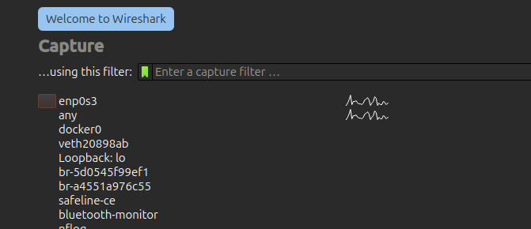
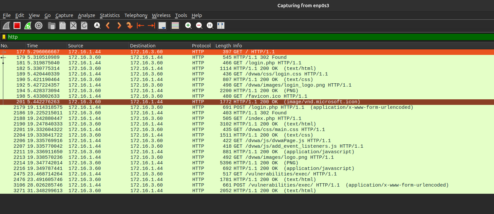
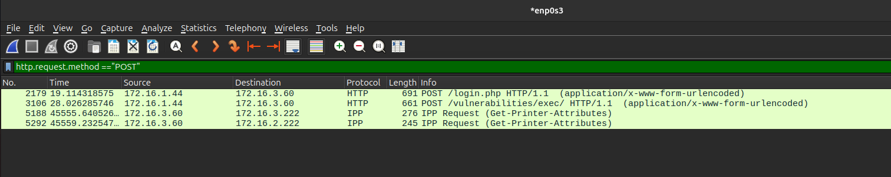
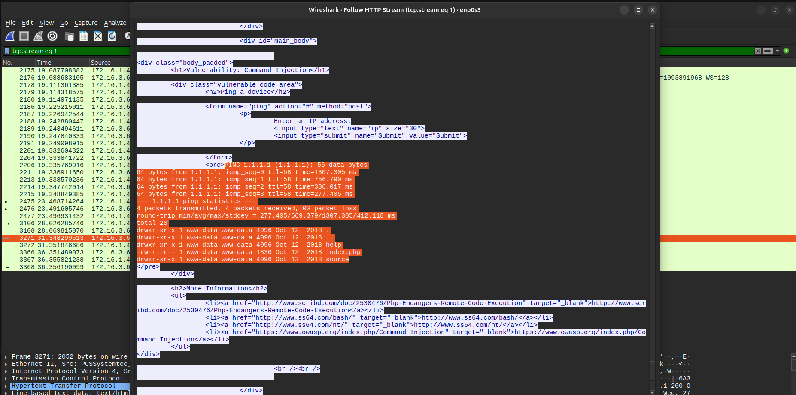

# Analyzing Network Traffic For Anomalous Behavior using WireShark

# Introduction

Analyzing network traffic is one of the most critical areas of cybersecurity today. It helps **forensic investigators** and **SOC Analysts** understand the root cause of attacks, trace malicious behavior, and create defensive strategies.

In this blog, we’ll set up a vulnerable web application in a controlled environment, simulate an attack against it, and then focus on **analyzing the captured traffic in Wireshark**. The goal isn’t to learn how to exploit vulnerabilities, but rather to see how such activity looks on the network and what evidence defenders can rely on.

This exercise provides a safe, hands-on way to understand how attackers operate and, more importantly, how defenders can detect suspicious activity by inspecting raw packets.

---

## Prerequisites

Before diving in, make sure you have the following setup ready:

- **Two Virtual Machines**:
    - **Ubuntu VM** to install DVWA
    - **Kali Linux VM** to simulate the attacker
- A basic understanding of:
    - Linux command-line operations
    - IP addressing in virtual environments

---

## Setting up the the Environment

### Step 1:

install Virtual Machines:

1. Kali Linux  —> You can find the setup instructions of kali VM on VirtualBox [here](https://www.kali.org/docs/virtualization/install-virtualbox-guest-vm/)
2. Ubuntu —> You can find the setup instructions [here](https://ubuntu.com/tutorials/how-to-run-ubuntu-desktop-on-a-virtual-machine-using-virtualbox#1-overview)

### Step 2:

set up the networks inside VirtualBox

1. Next we need to configure the Virtual Machines to use a network.
    1. click the setting icon on the Kali VM.
    2. Go to the network tab
    3. Change the ‘attached to’ to `bridged network`
    4. Click OK
    
    **Now do the same for the ubuntu VM.**
    

Selecting bridged network will make your VM look like a legitimate device in your home network and receive IP address from the Router.

### Step 3:

Set up DVWA

1. Start the Ubuntu Virtual Machine and open up a terminal. check the network connectivity.

We will be running DVWA in a container for simplicity, this will save us from installing the dependencies of DVWA.

1. in the terminal type this:
    
    ```bash
    sudo apt-get update && sudo apt-get install docker.io -y && docker run -itd -p 80:80 vulnerables/web-dvwa
    
    ```
    
    This will install and start DVWA container with its port 80 mapped to the hosts port 80. 
    
2. Go to [*localhost](http://localhost)* in the ubuntu browser 
    1. Login by simply clicking the login button with no credentials
    2. From the welcome page go down and click *reset/create database.*
    3. login again using `*admin:password*`

Now DVWA is also set up.

Now Any device on the Network can view the DVWA Website.

### Step 4:

Install and start WireShark by typing this in the ubuntu’s terminal:

```bash
sudo apt-get install wireshark
```

---

## Starting the packet capture

Start WireShark from the terminal using `sudo wireshark` and click on the interface connected as bridged in our VM Configuration. An easy way to find this is to check for the interface that shows most traffic.



For me it is enp0s3.

**Click on it start the Capture.**

---

## Start the attack using Kali

Start your kali machine and go to the ubuntu VM’s IP

lets perform a command injection.

1. Login using `*admin:password*`
2. Go to the command injection page from the navigation menu.
    
    
    
    This features default behavior is to ping an IP address and show the result. in the backend this is the command that is being run: `ping -c  4 <ip address>` But here we have a command injection vulnerability, in the place of the IP address we will add a semi-column and run a command. That will make the entire command look like this: `ping -c 4 <ip address>; ls -la` in the backend. this will give us the result of `ls -la` appended with the result of the ping command like this:
    
    
    
    There it is, This actually sent a POST request to the webserver.
    

---

## Analyzing the Captured Traffic

Now that we did the attack and the traffic to the webpage has been captured in WireShark, its time to analyze the traffic.

### Step 1:

Go to WireShark in Ubuntu VM.


You can see the traffic coming in. Now we need to filter it to find the traffic that went to the webserver.

There are multiple filters we can use, port, ip, protocol etc.

For now lets filter the packets using **`http`.** This will only show HTTP Traffic.

In the filter input box simply type `http`.



Now we can see all the HTTP Traffic. 

Now Lets filter it to view only the HTTP POST traffic

Type this in the filter bar: `http.request.method == “POST”`



If we look at the info column we can see the path to the command injection page in DVWA which is `/vulnerabilities/exec` 

Right Click on it, then Follow > HTTP Stream. 

In the new windows If you scroll down, you can see the result of the command injection exploit we used.



---

### By now you have successfully:

- Generated malicious traffic from an attacker.
- Captured Network traffic with the malicious payload using wireshark.
- pinpointed the payload inside the captured packets that caused the command injection using wireshark filters.

---

## Conclusion

This lab shows how even a simple web attack leaves a clear trace in network traffic. By filtering and examining packets in Wireshark, we can find exactly where the attack occurred and what data was sent.

While this was a controlled exercise, the same method applies in real investigations: start with a capture, narrow down the traffic, and inspect it carefully to uncover meaningful evidence.